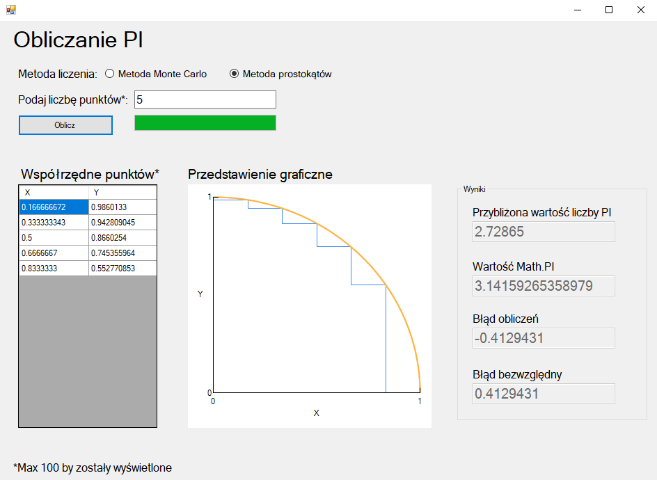

# PI approximation

> A Windows Forms program to calculate approximation of PI using two methods: Monte Carlo and numerical integral.

## Table of contents

- [PI approximation](#pi-approximation)
  - [Table of contents](#table-of-contents)
  - [General info](#general-info)
  - [Technologies](#technologies)
  - [Setup](#setup)
  - [Features](#features)
  - [Screenshots](#screenshots)
  - [Youtube video](#youtube-video)
  - [Status](#status)
  - [Why did I create it](#why-did-i-create-it)
  - [Contact](#contact)

## General info

Program allows to estimate PI based on your number of randomly generated points.
[How it works?](https://www.geeksforgeeks.org/estimating-value-pi-using-monte-carlo/)

Using second method you will be asked to put number of rectangles to create. [How seconds method works?](https://www.wired.com/story/this-pi-day-calculate-the-value-of-pi-for-yourself/)

_I suggest not to put too big numbers with less than 8Gb RAM, max. 1 000 000._

## Technologies

* Windows Forms
* .NET Framework 4.7.2

## Setup

TBD

## Features

* Calculates approximation of PI
* Shows errors in relation to const PI
* Uses two methods
* One language: Polish

To upgrade:

* Add english language
* Next methods to calculate

## Screenshots

## Youtube video

[Check how it works!](https://www.youtube.com/watch?v=6tae28SgbTA)

## Status

Project is _expansionable_.

That means it is finished and I like how it works. But I am open to any issues connected to it (such as bug fix or adding new features in the long long future).

## Why did I create it

I was inspired by my friend who had to make similar program for studies. So I thought it would be great way to learn WinForms and here it is.

## Contact

You can find contact information [here](https://jacek-jendrzejewski.azurewebsites.net/Contact).
